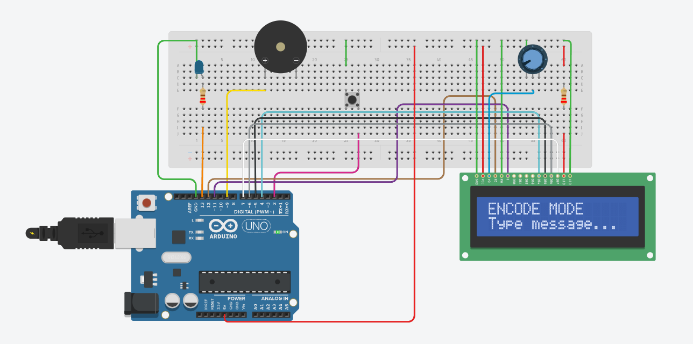

# Morse Communicator — Bare-Metal AVR C

A two-way Morse code terminal for the ATmega328P (Arduino Uno), written in pure C with
**no Arduino libraries** and **no blocking delays** — all timing is driven by hardware
timer interrupts.

> CO321 Embedded Systems Project (2026)
> Department of Computer Engineering, University of Peradeniya

Repo: [github.com/SasangaHerath/morse-communicator](https://github.com/SasangaHerath/morse-communicator)

---

## What it does

The system alternates between two modes automatically:

**ENCODE mode** — You type a message into the serial monitor (9600 baud) and press Enter.
Each character is looked up in the International Morse table and played out as light and
sound: the LED and an 800 Hz buzzer tone turn on together for each dot (300 ms) or dash
(900 ms). The LCD shows the current character alongside its Morse pattern. When the
message finishes, the system switches to decode mode.

**DECODE mode** — You tap the push button. A press shorter than 500 ms registers as a dot,
longer as a dash. A 900 ms pause ends a character; a 2100 ms pause inserts a word space.
Decoded text appears on the LCD's second row and is echoed over serial. Sending the
prosign **AR** (`.-.-.`) ends the transmission and returns to encode mode.

## Design notes

- **No `_delay_ms()` in the main loop.** Timer0 fires a compare-match interrupt every 1 ms
  to maintain a `millis()`-style tick counter. Both encode and decode are written as
  non-blocking state machines that poll this counter, so the button stays responsive
  while Morse is playing.
- **Timer1 in CTC mode** toggles OC1A (PB1) to generate the 800 Hz buzzer tone in hardware —
  the CPU never bit-bangs the tone.
- **UART RX is interrupt-driven** into a 64-byte ring buffer, so typed characters are never
  dropped mid-playback.
- **The LCD is driven in 4-bit mode** over PD7:PD4 with a hand-rolled HD44780 init sequence.

## Circuit diagram



Live, editable simulation: [Tinkercad — Morse Communicator](https://www.tinkercad.com/things/bfQ80ubKEsO-morse-communicator)

## Hardware wiring

| Component | Arduino pin | AVR port |
|---|---|---|
| LED (via 220 Ω to GND) | D13 | PB5 |
| Buzzer (to GND) | D9 | PB1 / OC1A |
| Push button (other leg to GND, internal pull-up) | D2 | PD2 |
| LCD RS | D12 | PB4 |
| LCD EN | D11 | PB3 |
| LCD D4 | D4 | PD4 |
| LCD D5 | D5 | PD5 |
| LCD D6 | D6 | PD6 |
| LCD D7 | D7 | PD7 |

LCD RW and VSS to GND, VDD to 5 V, V0 to a potentiometer wiper for contrast, A to 5 V via
220 Ω and K to GND for the backlight.

## Project structure

```
morse-communicator/
├── platformio.ini       # Build config: board, framework, upload settings
├── src/
│   └── main.c         # Firmware — no Arduino library calls
├── docs/
│   └── circuit-diagram.png
└── README.md
```

## Building and running

**PlatformIO (recommended):**

```bash
pio run                 # build
pio run --target upload # build and flash to a connected Uno
pio device monitor -b 9600  # open the serial terminal
```

PlatformIO handles the toolchain and `F_CPU`/baud setup automatically via `platformio.ini`.

**Tinkercad Circuits** — Paste the contents of `src/main_V1.c` into the code editor in Text
mode. The file exposes `setup()` and `loop()` for compatibility, but calls no Arduino
library functions.

**Bare avr-gcc, without PlatformIO:**

```bash
avr-gcc -mmcu=atmega328p -DF_CPU=16000000UL -Os -o main.elf src/main_V1.c
avr-objcopy -O ihex -R .eeprom main.elf main.hex
avrdude -c arduino -p m328p -P /dev/ttyUSB0 -b 115200 -U flash:w:main.hex
```

Note that `F_CPU` must be defined at compile time — the UART baud divisor depends on it.
This route also needs a `main()` that calls `setup()` then loops on `loop()`, since neither
is provided outside the Arduino framework.

## Timing reference

| Element | Duration |
|---|---|
| Dot | 300 ms |
| Dash | 900 ms |
| Gap between symbols | 300 ms |
| Gap between characters | 900 ms |
| Gap between words | 2100 ms |

Deliberately slow so the output is readable by eye and ear during a demo.

## Supported characters

A–Z and 0–9. Spaces are honoured as word gaps. Unrecognised Morse decodes to `?`.
